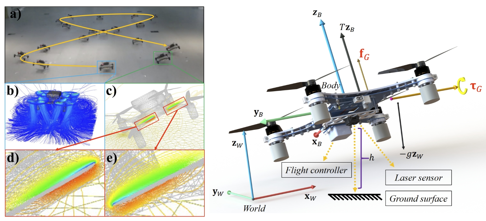
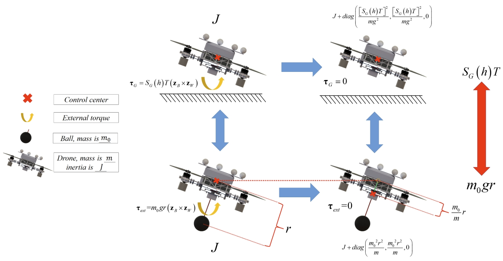
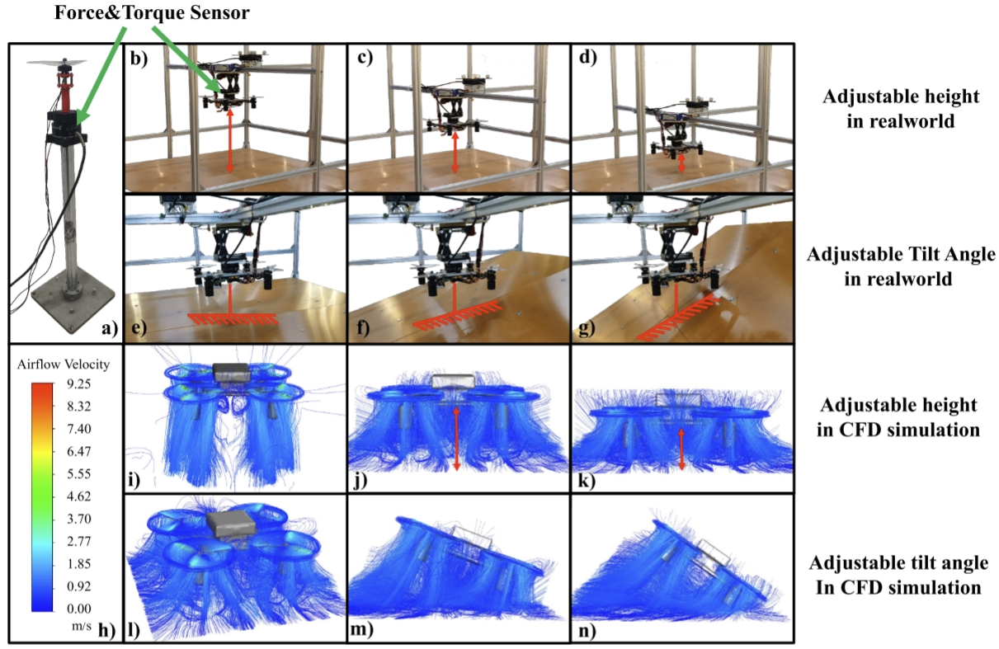

# Ground-Effect-Aware-Modeling-and-Control-for-Multicopters
Ground effectness investigation. Submission to TMECH.
## Introduction
This study investigates the dynamic characteristics of multicopters during near-ground flight and proposes a set of dynamic models and control methods. Through the utilization of a physical dynamics testing platform and Computational Fluid Dynamics (CFD) simulation, the analysis and research are conducted on the disturbances experienced by multicopters during near-ground flight. Simplified models for ground effect forces and moments are presented, along with a corresponding control framework, to ensure the stability of multicopters during nearground flight. Notably, the modeling and compensation control methods for external moments (excluding external forces) are believed to be pioneering in this study. Additionally, a center of gravity height optimization method is introduced to take advantage of the energy-saving properties of ground effect, ensuring a low center of gravity height for the multicopters during flight while avoiding contact with the ground.

  
   
  <em>Figure 1: ANSYS analysis and our drone</em>

As shown in **Figure 1**: (a) The drone is flying close to the ground, ensuring a consistent distance from the surface as it navigates. (b) Multicopter flying at a level attitude near the ground encounter airflow patterns influenced by changes in airflow direction. These variations in airflow direction can create reversed momentum, which may be a contributing factor to the generation of additional forces. (c) Blades with different height from the ground have different pressure differences in the CFD simulation. (d)(e) The difference in pressure between the upper and lower surfaces of the propeller blades can potentially result in the generation of a torque that helps bring the drone’s attitude back to a level position.

  
   
  <em>Figure 2: Force analysis and its equivalent form</em>

As shown in **Figure 2**, the ground effectness can be seen as the counterweight ball hanging below the multicopter.

  
   
  <em>Figure 3: Experiment via real platform and fluid simulation</em>

As shown in ** Figure 3 ** Experimental environment for model validation (including both realworld and simulation). (a) Platform for an individual motor. (b)∼(g) The test platform uses wooden planks to simulate the ground and collect data on the ground effect disturbances experienced by multicopter. (b)∼(d) The ground height can be adjusted. (e)∼(g) The tilt angle can be adjusted to simulate the pitch angle of the multicopter. (h)∼(n) CFD simulation was used to verify the model. (h) Airflow velocity (m/s) in Fig. (h)∼(n).

## preprint paper
The paper, "Ground Effect-Aware Modeling and Control for Multicopters: Enhanced Precision and Energy Efficiency", is submitted to IEEE/ASME Transactions on Mechatronics(T-MECH), which is under review now.
